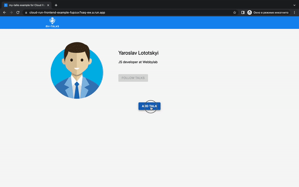

# Deploy the project on GCP. Cloud Run the basis for your services.

## Архітектура WEB проекту

В кожному проекті є своя архіектура, вона проектується заздалегідь на початковій стадії (що є правильно),
або ж корегується в стадії активної розробки. В будь-якому випадку вашому проекту потрібна веб архітекта з сервісами 
які її обслуговують. І от перед створення цієї архітектури виникає питання, яка платформа буде слугувати основою для 
нашої архітектури ?. Нам би хотілося щоб у нас була можливість розвернути наш проект із всіма його сервісами і бажнано
щоб ці сервіси знаходились на одній платформі. 

Тому почнемо ми цю статтю з GCP. Та розглянемо основні хмарні служби які нам потрібні будуть для розгортання нашого
тестового проекту. За основу для нашого проекту ми візьмемо платформу для спікерів та їхніх підписників https://my-talks.net/ .


 ## Проект та його сервіси

[My-talks](https://my-talks.net/) це портфоліо для спікера, хаб цікавих докладів для користувачів, і не забули вньому про 
організаторів з їхніми Call For Papers. Для старту нашого тестового проекту нам потрібно буде розвернути такі сервіси:
 - beckend (Cloud Run)
 - frontend (Cloud Run)
 - storage for data (Cloud Storage)
 - database (Google Cloud SQL)

 Джерелом коду для нашого тестового проекту є два відкритих репозитарія :
 - https://github.com/yaroslav-lototskyi/cloud-run-backend-example
 - https://github.com/yaroslav-lototskyi/cloud-run-frontend-example


 ## Cloud Run the basis for your services

 Як ми бачимо основні наші сервіси будуть розгорнуті на платформі Cloud Run.
 Cloud Run це продукт GCP, який дає змогу без проблем створювати, налагоджувати та розгортати ваші сервіси 
 за допомогою serverless computing model. Cloud Run services дає нам змогу розгортати наші сервіси у вигляді контейнерів
 та включає в себе всі плюси serverless computing. Поміж них хочеться відзначити такі як :
- Підтримка будь-якої мови програмування та операційної системи за допомогою технології контейнеризації
- Автоматичне масштабування на основі запитів. Кожен сервіс Cloud Run має унікальну кінцеву точку https і наші контейнери
автоматично горизонтально мастабуються залешно від запитів та навантаження на контейнер, налаштування якого ви ми жете змінити 
в будь-який момент
- Керування трафіком. Під час кожного розгортання сервісу створюється нова ревізія, до якої ви завжди можете повернутися
перенаправивши трафік повністю або частково

У Cloud Run є чудовий плюс у вигляді якісних інтеграцій та [API](https://cloud.google.com/apis/docs/overview). У Google Cloud дуже розвинена екосистема в різних технологічних напрямках.
[My-talks](https://my-talks.net/) використовує безліч корисних продуктів, але ось деякі які ми використаємо у 
нашому тестовому проекті для спікерів:
- Data storage (__Cloud Storage__, __Cloud SQL__)

## Розгорнемо наш проект на GCP

Хто ще не мав досвіду з даною платформою - для початку нам потрібно зареєструватися на платормі та створити проект. Потім створимо 
сховище для данних та налаштуємо базу данних.
І завершальним етапом буде створення сервісів у Cloud Run, де ми отримаємо посилання на наш мервіс frontend і зможемо 
фізично скористатися нашим додатком.

### Реєстрація на GCP та створення проекту

Для реєстрації у безкоштовній пробній версії перейдіть за посиланням https://console.cloud.google.com/freetrial/signup/tos та виконайте всі для цього кроки,
включаючи підтвердження платіжної інформації. Після успішного заповнення всіх облікових данних, автоматично створюється новий проект, у нашому випадку
він має назву - 'My First Project'. Також для роботи з різними інтеграціями та APIs потрібно включити : 
- [Compute Engine API](https://console.cloud.google.com/marketplace/product/google/compute.googleapis.com)  
- [Cloud Build API](https://console.cloud.google.com/apis/library/cloudbuild.googleapis.com)

### Створюємо bucket для нашого сховища (в данному випадку для картинок)

Переходимо за посиланням https://console.cloud.google.com/storage/browser та створюємо bucket, який ми потім будемо використовувати 
в нашому backend сервісі , а саме для збереження картинок. Cloud storage підтримує технологію S3, якою ми будемо користуватися. Тому це зручно тому хто
хоче переїхати з інших S3-подібних сервісів на Cloud storage.
<p align="center">
    
</p>

Потрібно буде заповнити наступні дані:
- Name your bucket (назвемо наш bucket cloud-run-backend-example.bucket)
- Choose where to store your data (виберіть регіон для сховища)
- В тих кроках які пропустили залишаємо значення за умовчанням та натискаємо кнопку CREATE BUCKET

Після того як ми створили Bucket, потрібно надамо всім користувачам право на читання файлів. Це робиться дуже просто за документацією https://cloud.google.com/storage/docs/access-control/making-data-public. Також зайдемо в налаштування та запамятовуємо собі певні поля, ці дані ми потім передамо у вигляді змінних оточення для нашого beckend сервісу:
- поле Storage URI (as env S3_ENDPOINT)
- поле Access key (as env S3_ACCESS_KEY_ID)
- поле Secret key (as env S3_SECRET_ACCESS_KEY)
<p align="center">
    
</p>

### Створюємо екземпляр бази даних SQL

Переходимо за посилання https://console.cloud.google.com/sql/instances та створюємо базу даних, до якої ми потім підєднаємось із нашого
beckend сервісу, в базі у нас для прикладу буде тільки одна таблиця з докладами спікера. Сам доклад ми потім створимо в нашому готовому веб-додатку.
<p align="center">
    
</p>

Механізм бази даних вибираємо MySQL
Потім потрібно буде заповнити наступні дані:
- Поле Instance ID (назвемо наш instance cloud-run-backend-example-instance)
- Поле Password (скористаємось автоматичною генерацією пароля та збережемо його для майбутніх налаштувань)
- Поле Region (виберіть регіон для бази даних)
- Zonal availability (вибираємо Single zone)

На цій же сторінці нижче натискаємо кнопку SHOW CONFIGURATION OPTIONS
<p align="center">
    
</p>

Та продовжуємо налаштування:
- Розділ Machine type (вибираємо shared core)
- Розділ Storage (вибираємо обєм 10GB)
- В тих кроках які пропустили залишаємо значення за умовчанням та натискаємо кнопку CREATE INSTANCE, та потрібно буде зачекати декілька хвилин
    для створення екземпляра

After creating an instance, we create the base itself. In the __Databases__ tab, click the __CREATE DATABASE__ button. We call the database __cloud-run-backend-example__.
<p align="center">
    
</p>

### Створення images для сервісів beckend && frontend

Перед роботою в Cloud Run, нам потрібно створити білди, щоб в майбутньому на основі них створити serverless сервіси.
Основою для білдів у нас слугуватимуть файли Dockerfile в наших тестових репозиторіях. Існує багато способів створити ці білди.
Наприклад збудувати їх локально та щоб ними скористуватися із потрібно їх запушити у Google Container Registry, для чого потрібно
мати локально установлену Cloud SDK. Також можна скористатися Continuous delivery інтеграцією, що дозволяє за декілька кроків створювати білд із
вказаного репозитарія. Але можливості цієї інтеграції набагато ширші, тому ця тема підлягає окремому обговоренню в наступному пості )
Ми скористаємося продуктом Google Cloud Shell. Це інтерактивна оболонка яка дозволяє керувати інфраструктурою вашого проекту із будь-якого браузера.
Суть в тому що в ній заздалегідь установлені інструменти які вам поирібні для цього, зокрема Google Cloud SDK.
Відкрити [Cloud Shell](https://cloud.google.com/shell) можна натиснувши на кнопку Activate Cloud Shell.
<p align="center">
    
</p>

Отже, нам потрібно клонувати наші тестові проекти і зробити білди. Вводимо наступні команди у відкритому Cloud Shell Command (Terminal):
- ```mkdir testProject && cd testProject``` (створюємо директорію для проектів)
- ```git clone https://github.com/yaroslav-lototskyi/cloud-run-frontend-example.git && git clone https://github.com/yaroslav-lototskyi/cloud-run-backend-example.git```
(клонуємо наші тестовіві проекти frontend && beckend)
- ```cd ~/testProject/cloud-run-backend-example && gcloud builds submit --tag gcr.io/$GOOGLE_CLOUD_PROJECT/cloud-run-backend-example```
(переходимо в директорію бекенд проекту та створюємо білд на основі Dockerfile)
- ```cd ~/testProject/cloud-run-frontend-example && gcloud builds submit --tag gcr.io/$GOOGLE_CLOUD_PROJECT/cloud-run-frontend-example```
(аналогічно для frontend)

Що відбувається в останніх двох командах ?. ```gcloud builds``` це бібліотека, яку ми з вами раніше додали в нашу інфраструктуру. Вона використовує
технологію docker для збірки образів. Команда ```gcloud builds submit``` дозволяє нам зібрати образ та зберегти його на віддаленому сховищі ```gcr.io``` 
з відповідним тегом для нашого проекту GCP, до якого в нас вже є доступ. Як ви вже зрозуміли важливу роль відіграють наші Dockerfile на основі яких монтуються 
образи. Давайте розглянемо їх більш детально.

Нижче редставлений Dockerfile нашого backend сервісу. Це простий REST server додаток збудований на основі Express, який використовує Sequelize ORM для
нашої бази даних. Також наш бекенд вміє зберігати картинки в s3 сховище. Все що нам протрібно зробити це проінсталювати залежності та запустити сервер при старті контейнера.
<p align="center">
    
</p>

Нижче редставлений Dockerfile нашого frontend сервісу. Основою нашого веб-сервісу є бібліотека [NEXT.js](https://nextjs.org/). Все що нам потрібно зробити, 
це проінстілювати залежності та виконати збірку. Підчас старту контейнера ми запускаємо NEXT.js server .
<p align="center">
    
</p>

### Cloud Run. Створення backend сервісу

Ми вже на основній частині створення нашого проекту. Перед цим ми готували основу, створюючи базу даних , сховище для файлів та підготували готові образи для 
наших сервісів. І замітьте що це все ми зробили в ондій інфраструктурі. 

Отже створювати сервіси ми будемо створювати через [Cloud Run GCP console](https://console.cloud.google.com/run), натиснувши кнопку CREATE SERVICE.
<p align="center">
    
</p>

- Обираємо спосіб 'Deploy one revision from an existing container image' , де ми побачимо вже попередні зібрані нами образи для frontend і backend сервісів. Обираємо сloud-run-backend-example з тегом latest. 
<p align="center">
    
</p>

- обираємо регіон
- in the Authentication section, select the option Allow unauthenticated invocations.
- у вкладці VARIABLES & SECRETS заповнюємо всі змінні середовища які ми попередньо зберігали для нашого сервісу backend. Для конфеденційних даних
рекомендовано використовувати інтеграцію [Secret Manager API](https://cloud.google.com/secret-manager/docs). Змінна , яку ми раніше не зустрічали це DB_SOCKET_PATH .
Вона потрібна для зєднання із нашим екземпляром бази даних. Вона складається із ```/cloudsql/${INSTANCE_CONNECTION_NAME}```, INSTANCE_CONNECTION_NAME ви можете знайти на 
[сторінці вашого екземпляру бази даних](https://console.cloud.google.com/sql/instances/cloud-run-backend-example-db/overview) в розділі __Connect to this instance__ , поле 
__Connection name__ . Також там ми знайдемо дані для __DB_HOST__ змінної, це поле __Public IP address__.
<p align="center">
    
</p>

- у вкладці CONNECTIONS, обираємо Cloud SQL instance from the dropdown menu, який ми з вами попередньо вже створили .
<p align="center">
    
</p>

- всі інші поля за умовчаннням та натискаємо кнопку CREATE.

Після створення сервісу нам доступний інтерфейс з ревізіями, де ми можемо керувати трафіком. Також нам створюється унікальне посилання на наш сервіс, яке буде виступати як змінна __API_APP_ROOT_URL__ для нашогоfrontend сервісу.
Нам його потрібно зберегти. По суті це вже готовий URL для нашого бекенда, нам потрібно буде добавити це посилання в змінні оточення нашого frontend сервісу.
<p align="center">
    
</p>

### Cloud Run. Створення frontend сервісу

Аналогічно створенню сервісу для beckend, в інтерфейсі [Cloud Run Create Service](https://console.cloud.google.com/run/create) слідуємо наступним пунктам :
- обираємо спосіб 'Deploy one revision from an existing container image' та обираємо попередньо створений образ для frontend
- обираємо регіон
- поле Authentication - обираємо Allow unauthenticated invocations
- у вкладці VARIABLES & SECRETS додаємо змінну API_APP_ROOT_URL , значення якої це посилання на наш beckend сервіс
- у вкладці CONTAINER для поля Container port вказуємо порт під номером 3000. Саме під цим портом у нас стартує NEXT.js server. З таким налаштуванням
запити в контейнери будуть поступати на порт який нам потрібен.
<p align="center">
    
</p>

- всі інші поля за умовчаннням та натискаємо кнопку CREATE.

Все готово, після успішного створення ми отримуємо посилання на наш frontend
<p align="center">
    
</p>

Коли ми перейдемо по цьому посиланню, то зможемо скористуватися нашим додатком. В даному випадку створити доповідь з описом та постером.
<p align="center">
    
</p>

## Conclusion

GCP це платформа із широкою екосистемою продуктів. Ми з вами без проблем створили web додаток із своєю мінімальною інфраструктурою.
Сервіси які нам потрібні були, ми знайшли на платформі, зокрема __Cloud Storage__ && __Cloud Storage__ . Основою для нашого проекту є 
Cloud Run, який дає можливість розробляйти та розгортайти контейнерні програми з високою масштабованістю,
використовуючи вашу улюблену мову !)


