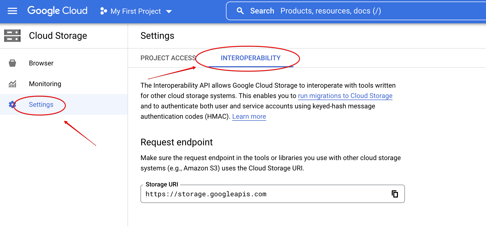
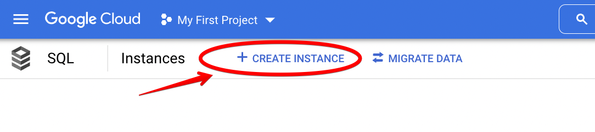
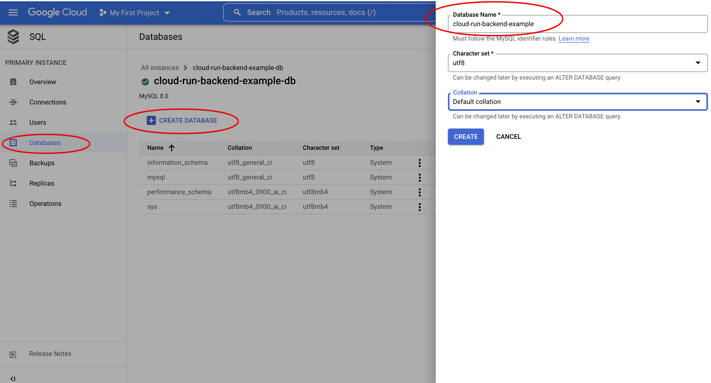
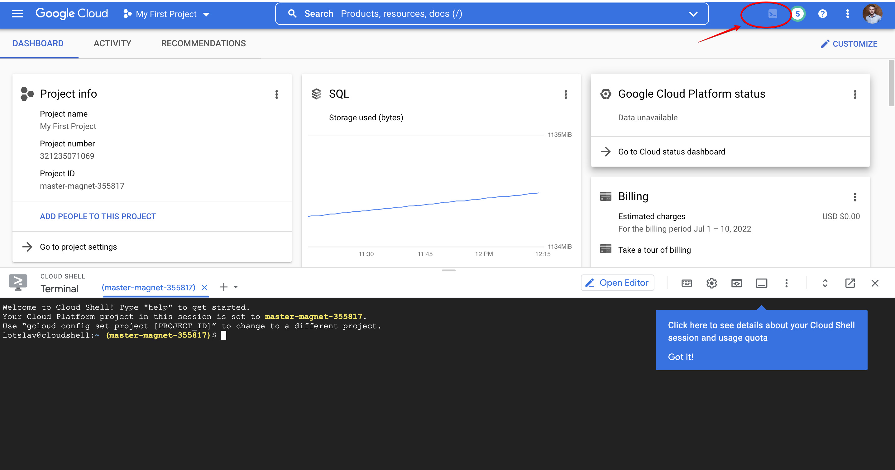
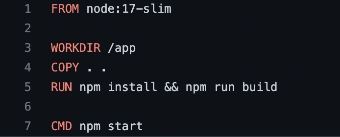
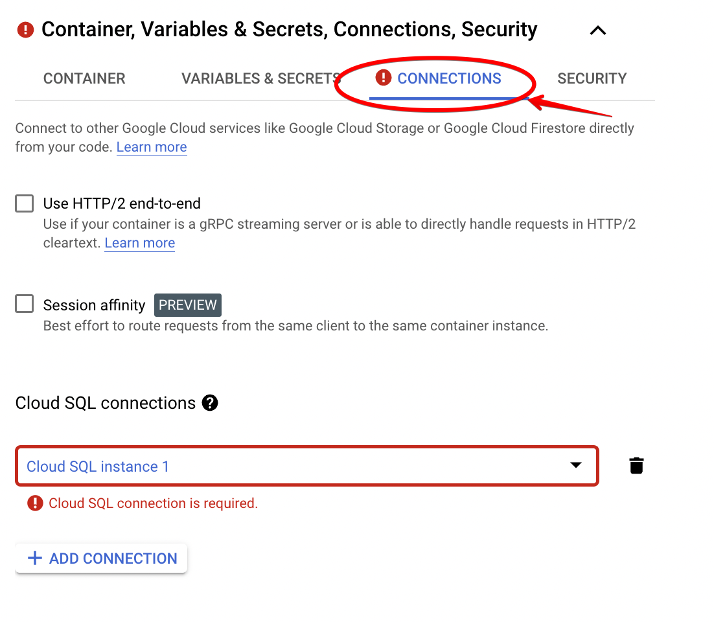
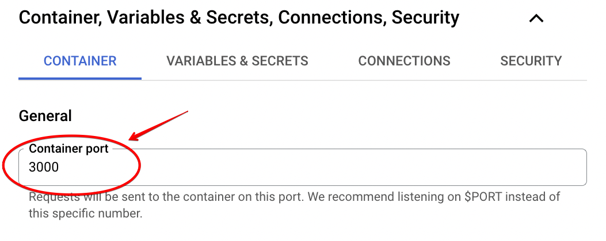
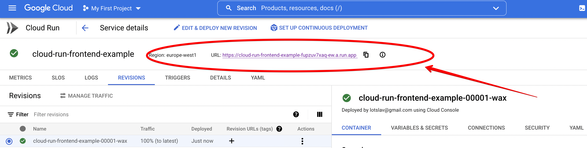

# Deploy the project on GCP. Cloud Run the basis for your services.

## WEB project architecture

Each project has its own architecture, it is designed at the initial stage (which is correct),
or is corrected in the stage of active development. In any case, your project needs a web architect with services
who serve it. And before creating this architecture, the question arises, which platform will serve as the basis for
of our architecture?. We would like to have the opportunity to deploy our project with all its services and it is desirable
so that these services are on the same platform.

Therefore, in this article we will look at [GCP](). Google Cloud Platform allows you to build and run applications, websites 
and services using the Google infrastructure. Consider the main cloud services that we will need to deploy ours
test project. As a basis for our project, we will take the platform for speakers and their subscribers [my-talks.net](https://my-talks.net/).

## The project and services

[my-talks.net](https://my-talks.net/) is a portfolio for a speaker, a hub of interesting talks for users, and we did not forget about
organizers with their Call For Papers. To start our test project, we will need to deploy the following services:
 - beckend (__Cloud Run__)
 - frontend (__Cloud Run__)
 - storage for data (__Cloud Storage__)
 - database (__Google Cloud SQL__)

 The source code for our test project is two open repositories:
 - https://github.com/yaroslav-lototskyi/cloud-run-backend-example
 - https://github.com/yaroslav-lototskyi/cloud-run-frontend-example

## Cloud Run the basis for your services

GCP has a great plus in the form of quality integrations and [APIs](https://cloud.google.com/apis/docs/overview). Google Cloud has a very developed ecosystem in various technological directions.
[My-talks](https://my-talks.net/) uses many useful products, but here are some that we will use in
to our test project for speakers:
- Cloud Run
- Data storage (__Cloud Storage__, __Cloud SQL__)
- Google Cloud Shell

As we see it, our main services will be deployed on the [Cloud Run](https://cloud.google.com/run) platform. 
Cloud Run is a GCP product that makes it easy to build, configure, and deploy your services
using the [serverless computing model](https://en.wikipedia.org/wiki/Serverless_computing).Cloud Run services enables us
to deploy our services as containers and includes all the advantages of serverless computing, including:
- Support for any programming language and operating system using containerization technology.
- Automatic scaling based on requests. Each Cloud Run service has a unique https endpoint and our containers
are automatically horizontally scaled depending on the requests and load on the container, the settings of which you can change
at any moment.
- Traffic management. Each time a service is deployed, a new revision is created that you can always return to
by redirecting traffic in whole or in part.

## Let's deploy our project on GCP

For those who have not yet had experience with this platform - to begin with, we need to register on the platform and create a project. Then we will create
data storage and configure the database.
And the final stage will be the creation of services in Cloud Run, where we will get a link to our servis frontend and be able to
physically use our application.

### Registering on GCP and creating a project

To sign up for a free trial, go to https://console.cloud.google.com/freetrial/signup/tos and follow all the steps,
including confirmation of payment information. After successfully filling in all credentials, a new project is automatically created, in our case
it is called 'My First Project'. Also, to work with various integrations and APIs, you need to activate:
- [Compute Engine API](https://console.cloud.google.com/marketplace/product/google/compute.googleapis.com)  
- [Cloud Build API](https://console.cloud.google.com/apis/library/cloudbuild.googleapis.com)


### Creating a bucket for our storage (in this case for pictures)

Go to the link https://console.cloud.google.com/storage/browser and create a bucket that we will use later
in our backend service, namely for saving pictures. Cloud storage supports S3 technology, which we will use. Therefore, it is convenient for anyone
wants to move from other S3-like services to Cloud storage.
<p align="center">
    
</p>

We will need to fill in the following data:
- Name your bucket (let's call our bucket __cloud-run-backend-example.bucket__).
- Choose where to store your data (select a region for storage).
- In those steps that were skipped, leave the default values ​​and press the __CREATE BUCKET__ button.

After we have created the Bucket, we need to give all users the right to read the files. This is done very simply according to the documentation https://cloud.google.com/storage/docs/access-control/making-data-public#buckets. We will also go into the settings and remember certain fields, we will then transfer these data in the form of environment variables for our beckend service:
- field __Storage URI__ (as env var __S3_ENDPOINT__).
- field __Access key__ (as env var __S3_ACCESS_KEY_ID__).
- field __Secret key__ (as env var __S3_SECRET_ACCESS_KEY__).
<p align="center">
    
</p>

### Creating an instance of the SQL database


Go to the link https://console.cloud.google.com/sql/instances and create a database to which we will then connect from our
beckend service, in the database we will have, for example, only one table with the speaker's talks. We will then create the talk itself in our finished web application.
<p align="center">
    
</p>


We choose MySQL as the database engine.
Then we will need to fill in the following data:
- __Instance ID__ field (let's call our instance __cloud-run-backend-example-instance__).
- __Password__ field (use automatic password generation and save it for future settings as env var __DB_PASSWORD__).
- __Region__ field (select the region for the database).
- __Zonal availability__ (select __Single zone__).


On the same page below, click the __SHOW CONFIGURATION PARAMETERS__ button
<p align="center">
    
</p>


Сontinue the settings:
- __Machine type__ section select __shared core__.
- __Storage__ section choose a volume of 10GB.
- In those steps that were skipped, leave the default values ​​and press the __CREATE INSTANCE__ button, and we will need to wait a few minutes
to create an instance.

After creating an instance, we create the base itself. In the __Databases__ tab, click the __CREATE DATABASE__ button. We call the database __cloud-run-backend-example__.
<p align="center">
    
</p>

### Creation of images for backend && frontend services

Before working in Cloud Run, we need to create builds in order to create serverless services based on them in the future.
Dockerfiles in our test repositories will serve as the basis for the images.There are many ways to create these builds.
For example, to build them locally and to use them, you need to push them in Google Container Registry, for which you need
have the [Google Cloud SDK](https://cloud.google.com/sdk) locally installed. You can also use the Continuous delivery integration, which allows you to create a build with a few steps the specified repository. But the possibilities of this integration are much wider, so this topic is subject to a separate discussion in the next post).
We will use the [Google Cloud Shell](https://cloud.google.com/shell) product.This is an interactive shell that allows you to manage the infrastructure of your project from any browser. Суть в тому що в ній заздалегідь установлені інструменти які вам поирібні для цього, зокрема __Google Cloud SDK__.
You can open __Cloud Shell__ by clicking the __Activate Cloud Shell__ button. 
<p align="center">
    
</p>

So we need to clone our test projects and make builds. Enter the following commands in the open Cloud Shell Command (Terminal):
- ```mkdir testProject && cd testProject``` (create a directory for projects)
- ```git clone https://github.com/yaroslav-lototskyi/cloud-run-frontend-example.git && git clone https://github.com/yaroslav-lototskyi/cloud-run-backend-example.git```
(clone our test projects frontend && beckend)
- ```cd ~/testProject/cloud-run-backend-example && gcloud builds submit --tag gcr.io/$GOOGLE_CLOUD_PROJECT/cloud-run-backend-example```
(go to the backend project directory and create a build based on the Dockerfile)
- ```cd ~/testProject/cloud-run-frontend-example && gcloud builds submit --tag gcr.io/$GOOGLE_CLOUD_PROJECT/cloud-run-frontend-example```
(similarly for frontend)

What happens when we run the last two commands?. ```gcloud builds``` is a library that we previously added to our infrastructure. She uses
docker technology for building images. The ```gcloud builds submit``` command allows us to build the image and save it to the remote repository __gcr.io__
with the appropriate tag for our GCP project that we already have access to. As we have already understood, an important role is played by our Dockerfiles, based on which they are mounted images. Let's look at them in more detail.


Below is the Dockerfile of our backend service. This is a simple REST server application built on Express, which uses the Sequelize ORM for
our database. Also, our backend can store images in s3 storage. All we need to do is install the dependencies and start the server when the container is started.
<p align="center">
    
</p>

Below is the Dockerfile of our frontend service. The basis of our web service is the [NEXT.js](https://nextjs.org/) library. All we have to do is
is to install the dependencies and run the build. During the start of the container, we run the NEXT.js server.
<p align="center">
    
</p>

### Cloud Run. Create backend service

We are already in the main part of creating our project. Before that, we prepared the basis by creating a database, storage for files and prepared ready-made images for
our services. And note that we did all this in that infrastructure.

So, we will create services through the [Cloud Run GCP console](https://console.cloud.google.com/run) by clicking the __CREATE SERVICE__ button.
<p align="center">
    
</p>

- We choose the __Deploy one revision from an existing container image__ method, where we will see the previously builded images for frontend and backend services. Select __cloud-run-backend-example__ with the latest tag.
<p align="center">
    
</p>

- choose the region
- in the __Authentication__ section, select the option __Allow unauthenticated invocations__.
- in the __VARIABLES & SECRETS__ tab, fill in all the environment variables that we previously saved for our backend service. For confidential data
it is recommended to use the [Secret Manager API](https://cloud.google.com/secret-manager/docs) integration. A variable we haven't seen before is __DB_SOCKET_PATH__.
It is needed to connect to our database instance. It consists of ```/cloudsql/${INSTANCE_CONNECTION_NAME}```, you can find __INSTANCE_CONNECTION_NAME__ at
[your database instance page](https://console.cloud.google.com/sql/instances/cloud-run-backend-example-db/overview) under __Connect to this instance__ , field
__Connection name__. Also there we will find the data for the __DB_HOST__ variable, this is the __Public IP address__ field.
<p align="center">
    
</p>


- in the __CONNECTIONS__ tab, select the Cloud SQL instance from the dropdown menu, which we have previously created.
<p align="center">
    
</p>

- all other fields by default and press the __CREATE__ button.

After creating the service, an interface with revisions is available to us, where we can manage traffic. Also, a unique link to our service is created for us, which will act as a variable __API_APP_ROOT_URL__ for our frontend service. We need to save it. In fact, this is already a ready-made URL for our backend, we will need to add this link to the environment variables of our frontend service.
<p align="center">
    
</p>

### Cloud Run. Create frontend service

Similarly to creating a service for the backend, in the interface [Cloud Run Create Service](https://console.cloud.google.com/run/create) we follow the following points:
- choose the __Deploy one revision from an existing container image__ method and choose a previously created image for the frontend.
- choose the region.
- in the __Authentication__ section, select the option __Allow unauthenticated invocations__.
- in the __VARIABLES & SECRETS__ tab, add the __API_APP_ROOT_URL__ variable, the value of which is a link to our backend service.
- in the __CONTAINER__ tab, for the __Container port__ field, specify the port number ```3000```. It is under this port that we start the NEXT.js server. With this setup
requests to containers will go to the port we need.
<p align="center">
    
</p>

- all other fields by default and press the __CREATE__ button.


Everything is ready, after successful creation we get a link to our frontend
<p align="center">
    
</p>

When we follow this link, we will be able to use our application. In this case, create a talk with a description and a poster.
<p align="center">
    
</p>

## Conclusion

GCP is a platform with a broad product ecosystem. We created  a web application with our minimal infrastructure without any problems.
The services we needed were hosted on the platform, including __Cloud Storage__ && __Cloud Storage__ . The basis for our project is
Cloud Run, which enables the development and deployment of containerized applications with high scalability,
using your favorite language!)


